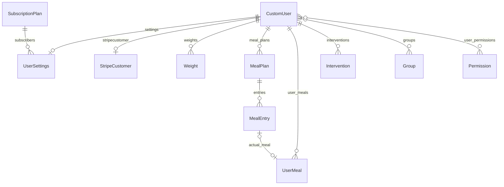

# Database structure

DigFit uses Django's ORM. Default development storage is SQLite (`db.sqlite3`); production typically uses PostgreSQL via `DATABASE_URL` (see `core/settings.py`).

This document describes **application-owned models** and how they relate. Django also creates tables for `contrib` apps (auth, admin, sessions, contenttypes, sites) and for **django-allauth** (email verification, social accounts, etc.); those follow upstream schemas and are not duplicated field-by-field here.

---

## Entity overview



---

## `accounts_customuser` (`apps.accounts.CustomUser`)

Email-only user; `AUTH_USER_MODEL` is `accounts.CustomUser`. Extends Django's `AbstractUser` with **`username`, `first_name`, and `last_name` removed**. Uses **`email`** as the unique login identifier (`USERNAME_FIELD`).

Three user roles are supported via the `role` field:

| Role | Value | Description |
|------|-------|-------------|
| Admin | `admin` | Full administrative access |
| Coach | `coach` | Can manage assigned users' plans and interventions |
| Regular User | `user` | Standard end-user (default) |

| Column | Type | Notes |
|--------|------|--------|
| `id` | BIGINT PK | Auto |
| `password` | VARCHAR(128) | Hashed |
| `last_login` | TIMESTAMP | Nullable |
| `is_superuser` | BOOLEAN | Default false |
| `is_staff` | BOOLEAN | Default false |
| `is_active` | BOOLEAN | Default true |
| `date_joined` | TIMESTAMP | Default now |
| `email` | VARCHAR(254) | **UNIQUE** |
| `name` | VARCHAR(255) | Blank allowed |
| `role` | VARCHAR(20) | Choices: `admin`, `coach`, `user`; default `user` |
| `date_of_birth` | DATE | Nullable |
| `gender` | VARCHAR(20) | Choices: `male`, `female`, `other`, `prefer_not_to_say`; blank allowed |
| `metadata` | JSON | Default `{}` |

**Convenience properties (not stored):** `is_admin_role`, `is_coach`, `is_regular_user` — boolean checks against the `role` field.

**Coach metadata keys** (stored in `metadata` JSON when `role = 'coach'`):

| Key | Type | Description |
|-----|------|-------------|
| `speciality` | string | Area of expertise, e.g. "Strength & Conditioning" |
| `years_of_experience` | int \| null | Years of professional coaching experience |

These fields are rendered dynamically in the Admin user CRUD form when the Coach role is selected.

**M2M (through default join tables):**

- `accounts_customuser_groups` -> `auth_group`
- `accounts_customuser_user_permissions` -> `auth_permission`

---

## `dashboard_subscriptionplan` (`apps.dashboard.SubscriptionPlan`)

Sellable plans surfaced in the dashboard; seeded for demos.

| Column | Type | Notes |
|--------|------|--------|
| `id` | BIGINT PK | Auto |
| `name` | VARCHAR(100) | |
| `slug` | VARCHAR | **UNIQUE** (SlugField) |
| `description` | TEXT | |
| `price` | DECIMAL(10,2) | |
| `interval` | VARCHAR(20) | Choices: `monthly`, `yearly`; default `monthly` |
| `features` | JSON | Default `[]` |
| `is_active` | BOOLEAN | Default true |
| `created_at` | TIMESTAMP | `auto_now_add` |
| `updated_at` | TIMESTAMP | `auto_now` |

---

## `dashboard_usersettings` (`apps.dashboard.UserSettings`)

One row per user: notifications, optional API key metadata, and subscription mirror fields (aligned with Stripe flow in the app).

| Column | Type | Notes |
|--------|------|--------|
| `id` | BIGINT PK | Auto |
| `user_id` | BIGINT FK | **UNIQUE** -> `accounts_customuser.id`, `CASCADE`, `related_name='settings'` |
| `notify_comments` | BOOLEAN | Default false |
| `notify_updates` | BOOLEAN | Default false |
| `notify_marketing` | BOOLEAN | Default false |
| `api_key_hash` | VARCHAR(64) | Blank default; stores hash only |
| `api_key_prefix` | VARCHAR(12) | Blank default; display prefix |
| `api_key_created_at` | TIMESTAMP | Nullable |
| `subscription_plan_id` | BIGINT FK | Nullable -> `dashboard_subscriptionplan.id`, `SET_NULL`, `related_name='subscribers'` |
| `subscription_status` | VARCHAR(20) | Choices: `active`, `inactive`, `cancelled`, `trial`; default `inactive` |
| `subscription_start_date` | TIMESTAMP | Nullable |
| `subscription_end_date` | TIMESTAMP | Nullable |
| `trial_end_date` | TIMESTAMP | Nullable |
| `created_at` | TIMESTAMP | `auto_now_add` |
| `updated_at` | TIMESTAMP | `auto_now` |

**Logic (not stored):** `is_subscription_active` / `is_trial_active` on the model compare status and dates to `timezone.now()`.

---

## `subscriptions_stripecustomer` (`apps.subscriptions.StripeCustomer`)

Links a user to Stripe customer (and optional subscription) IDs.

| Column | Type | Notes |
|--------|------|--------|
| `id` | BIGINT PK | Auto |
| `user_id` | BIGINT FK | **UNIQUE** -> `accounts_customuser.id`, `CASCADE` |
| `stripe_customer_id` | VARCHAR(255) | |
| `stripe_subscription_id` | VARCHAR(255) | Blank default |
| `subscription_status` | VARCHAR(50) | Blank default (Stripe mirror string) |
| `created_at` | TIMESTAMP | `auto_now_add` |
| `updated_at` | TIMESTAMP | `auto_now` |

---

## `dashboard_weight` (`apps.dashboard.Weight`)

Tracks user weight over time. Admin-only CRUD in the dashboard; full REST API at `/api/weights/`.

| Column | Type | Notes |
|--------|------|--------|
| `id` | BIGINT PK | Auto |
| `user_id` | BIGINT FK | -> `accounts_customuser.id`, `CASCADE`, `related_name='weights'` |
| `datetime` | TIMESTAMP | When the weight was recorded |
| `value` | DECIMAL(6,2) | Weight in lbs |
| `source` | VARCHAR(20) | Choices: `manual`, `api`, `import`, `device`; default `manual` |
| `metadata` | JSON | Default `{}` |

**Index:** `(user_id, -datetime)`

---

## `dashboard_mealplan` (`apps.dashboard.MealPlan`)

Structured meal plan container with daily targets, dietary preferences, and child entries. Admin-only CRUD in the dashboard; full REST API at `/api/meal-plans/`.

| Column | Type | Notes |
|--------|------|--------|
| `id` | BIGINT PK | Auto |
| `user_id` | BIGINT FK | -> `accounts_customuser.id`, `CASCADE`, `related_name='meal_plans'` |
| `title` | VARCHAR(255) | Plan name, e.g. "Week 1 — Cutting" |
| `start_date` | DATE | Plan start |
| `end_date` | DATE | Plan end |
| `daily_calorie_target` | INTEGER | Nullable |
| `daily_protein_target` | DECIMAL(6,2) | Nullable |
| `daily_carbs_target` | DECIMAL(6,2) | Nullable |
| `daily_fat_target` | DECIMAL(6,2) | Nullable |
| `daily_water_target_ml` | INTEGER | Nullable |
| `dietary_preference` | VARCHAR(30) | Choices: `none`, `vegetarian`, `vegan`, `keto`, `high_protein`, `paleo`, `mediterranean`; default `none` |
| `allergies_restrictions` | JSON | Default `[]`; list of strings |
| `supplements` | JSON | Default `[]`; list of strings |
| `goal` | VARCHAR(100) | Blank allowed |
| `notes` | TEXT | Blank allowed |
| `created_at` | TIMESTAMP | `auto_now_add` |
| `updated_at` | TIMESTAMP | `auto_now` |

**Index:** `(user_id, -start_date)`

**Computed properties (not stored):** `total_calories`, `total_protein`, `total_carbs`, `total_fat` (sum of entries), `entry_count`, `adherence_rate` (% of entries linked to an actual UserMeal), `duration_days`.

---

## `dashboard_mealentry` (`apps.dashboard.MealEntry`)

Individual meal slot within a plan. Supports 7 meal types and links to actual meals for adherence tracking.

| Column | Type | Notes |
|--------|------|--------|
| `id` | BIGINT PK | Auto |
| `meal_plan_id` | BIGINT FK | -> `dashboard_mealplan.id`, `CASCADE`, `related_name='entries'` |
| `meal_type` | VARCHAR(30) | Choices: `breakfast`, `mid_morning_snack`, `lunch`, `evening_snack`, `dinner`, `post_workout`, `bedtime_snack` |
| `day_number` | POSITIVE INT | Day of the plan (1, 2, 3...) |
| `scheduled_time` | TIME | Nullable |
| `title` | VARCHAR(255) | e.g. "Oats + eggs + fruit" |
| `foods_json` | JSON | Default `[]`; detailed food items |
| `calories` | INTEGER | Default 0 |
| `protein` | DECIMAL(6,2) | Default 0 |
| `carbs` | DECIMAL(6,2) | Default 0 |
| `fat` | DECIMAL(6,2) | Default 0 |
| `portion_notes` | VARCHAR(255) | Blank allowed; e.g. "1 cup, 200g" |
| `substitutions` | JSON | Default `[]`; alternative foods |
| `sort_order` | INTEGER | Default 0; display order within a day |
| `actual_meal_id` | BIGINT FK | Nullable -> `dashboard_usermeal.id`, `SET_NULL`, `related_name='planned_entries'` |
| `created_at` | TIMESTAMP | `auto_now_add` |
| `updated_at` | TIMESTAMP | `auto_now` |

**Index:** `(meal_plan_id, day_number)`

---

## `dashboard_usermeal` (`apps.dashboard.UserMeal`)

Records actual meals taken by a user. Can be linked from MealEntry for planned-vs-actual tracking. Admin-only CRUD in the dashboard; full REST API at `/api/user-meals/`.

| Column | Type | Notes |
|--------|------|--------|
| `id` | BIGINT PK | Auto |
| `user_id` | BIGINT FK | -> `accounts_customuser.id`, `CASCADE`, `related_name='user_meals'` |
| `meal_type` | VARCHAR(30) | Choices: `breakfast`, `mid_morning_snack`, `lunch`, `evening_snack`, `dinner`, `post_workout`, `bedtime_snack` |
| `title` | VARCHAR(255) | |
| `time_taken` | TIMESTAMP | When the meal was consumed |
| `description` | TEXT | Blank allowed |
| `calories` | INTEGER | Default 0 |
| `metadata` | JSON | Default `{}` |
| `created_at` | TIMESTAMP | `auto_now_add` |
| `updated_at` | TIMESTAMP | `auto_now` |

**Index:** `(user_id, -time_taken)`

---

## `dashboard_intervention` (`apps.dashboard.Intervention`)

Health/fitness interventions assigned to users. Admin-only CRUD in the dashboard; full REST API at `/api/interventions/`.

| Column | Type | Notes |
|--------|------|--------|
| `id` | BIGINT PK | Auto |
| `user_id` | BIGINT FK | -> `accounts_customuser.id`, `CASCADE`, `related_name='interventions'` |
| `type` | VARCHAR(50) | Choices: `dietary`, `exercise`, `behavioral`, `medical`, `supplement`, `other` |
| `status` | VARCHAR(30) | Choices: `pending`, `active`, `completed`, `cancelled`, `skipped`; default `pending` |
| `priority` | VARCHAR(20) | Choices: `low`, `normal`, `high`, `urgent`; default `normal` |
| `title` | VARCHAR(255) | |
| `description` | TEXT | Blank allowed |
| `trigger_source` | VARCHAR(100) | Blank allowed |
| `target_metric` | VARCHAR(100) | Blank allowed |
| `target_value` | DECIMAL(10,2) | Nullable |
| `current_value` | DECIMAL(10,2) | Nullable |
| `action_json` | JSON | Default `{}` |
| `scheduled_at` | TIMESTAMP | Nullable |
| `completed_at` | TIMESTAMP | Nullable |
| `created_by` | VARCHAR(50) | Blank allowed |
| `created_at` | TIMESTAMP | `auto_now_add` |
| `updated_at` | TIMESTAMP | `auto_now` |

**Indexes:** `(user_id, -created_at)`, `(status)`

---

## Other tables in the same database

| Area | Purpose |
|------|---------|
| `django_*`, `auth_*` | Sessions, admin log, permissions, groups, content types |
| `django_site` | Multisite row used by allauth (`SITE_ID`) |
| `account_*`, `socialaccount_*` | django-allauth: email addresses, confirmations, social apps/accounts/tokens |

For authoritative third-party column lists, use Django's migration files under your virtualenv or run:

```bash
python manage.py inspectdb
```

---

## Maintenance

- After model changes: `make migrate` (or `python manage.py makemigrations` then `migrate`).
- Keep this file updated when you add models, fields, or change relationships.
